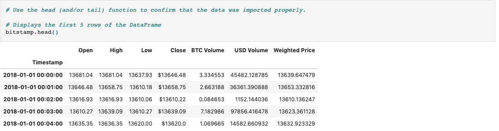

# Bitcoin_Arbitrage

An application used to compare two platforms (Bitstamp and Coinbase) that trade Bitcoin to find the arbitrage opportunities.

---

## Technologies

This application is written in Python v. 3.9.7 and uses the following libraries:

[pathlib](https://docs.python.org/3/library/pathlib.html) was used to call on various files and to save the resulting csv file

[pandas](https://pandas.pydata.org/docs/) was used for data collection, preparation, and analysis.

[matplotlib](https://matplotlib.org/stable/index.html) was used to plot data

---

## Installation Guide

Prior to running this application, perform the following in the command line to install the required libraries:

`pip install pathlib`

`pip install pandas`

`pip install matplotlib`

---

## Usage

In order to launch the application, navigate to the Bitcoin_Arbitrage folder that contains all of the code for this application, and then type into the command line:

```
jupyter lab
```

Once in jupyter lab, open the crypto_arbitrage.ipynb and run each cell in the jupyter file to see the resulting anlysis.

Below is an example of a cell's input code and the resulting output of the cell:



---

## Contributors

Robby Odum, Email: rodum012@gmail.com

---

## License

MIT